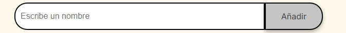

# 🎁 Challenge del Amigo Secreto

Este es un pequeño proyecto web donde puedes escribir los nombres de tus amigos, agregarlos a una lista y luego sortearlos aleatoriamente, ¿quién será tu **amigo secreto**?. ¡reuniones especiales!

---

## 🚀 ¿Cómo funciona?

1. Escribe los nombres de tus amigos en el campo de entrada.
2. Haz clic en **"Añadir"** para agregarlos a la lista.
3. Una vez tengas todos los nombres, presiona el botón para sortear.
4. El programa elegirá aleatoriamente uno de los nombres como tu amigo secreto.

---

## 🛠 Tecnologías utilizadas

- **HTML**
- **CSS**
- **JavaScript**

---

## 📦 ¿Cómo usarlo?

No necesitas instalar nada. Solo abre el siguiente enlace en tu navegador:

👉 [https://elcliptosi.github.io/challenge-amigo-secreto/](https://elcliptosi.github.io/challenge-amigo-secreto/)

---

## 👤 Autor

Proyecto desarrollado por **Jair Luna** como parte del programa **Alura Latam**.

---

## 🤝 Contribuciones

¡Claro que sí! Si tienes ideas o mejoras, siéntete libre de hacer un fork del proyecto y enviar un pull request.

---

## 📄 Licencia

Este proyecto no cuenta con una licencia específica por el momento.
